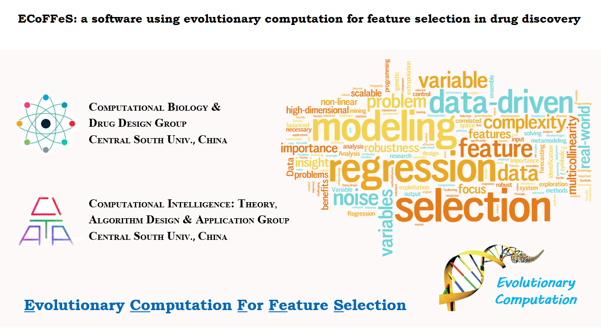

Installation
-----------------------------------

Operating Systems: 64-Bit, WinServer 2012 / Win7 SP1 / Win8 / Win8.1 / Win10

ECoFFeS: https://github.com/JiaweiHuang/ECoFFeS/tree/master/ECoFFeS_Installation

User Manual
-----------------------------------

Contents: Installation, Graphical User Interface, Introduction of ECoFFeS, and Applications of ECoFFeS

ECoFFeS Manual: https://github.com/JiaweiHuang/ECoFFeS/tree/master/ECoFFeS_Manual/ECoFFeS_Manual.pdf

Further Development
-----------------------------------

ECoFFeS is an open-source software which is developed based on MATLAB (Windows/Linux/Mac), release >= R2016a

ECoFFeS's Source Code: https://github.com/JiaweiHuang/ECoFFeS/tree/master/Others/Further_Development

PPT
-----------------------------------

A brief introduction to ECoFFeS

ECoFFeS's PPT: https://github.com/JiaweiHuang/ECoFFeS/tree/master/Others/PPT

License
-----------------------------------

ECoFFeS is freely available under the GNU General Public License.

LICENSE: https://github.com/JiaweiHuang/ECoFFeS/blob/master/Others/License/LICENSE

Publication
-----------------------------------

Jiawei Huang, Yong Wang, Alex F Chen and Dongsheng Cao. ECoFFeS: a software for feature selection using single/multi-objective evolutionary algorithms. In submission.

Abstract
-----------------------------------

Feature Selection is of particular importance to numerous applications in the fields of bioinformatics and cheminformatics. Among those methods for feature selection, evolutionary computation has recently gained increasing attention owing to its superior global search ability. To facilitate researchers to take advantage of evolutionary computation for feature selection, we present a user-friendly and standalone software named ECoFFeS. To the best of our knowledge, it is the first software to integrate a set of evolutionary algorithms (including two modified evolutionary algorithms proposed by the authors) with various evaluation combinations for feature selection. Among these evolutionary algorithms, four are single-objective evolutionary algorithms and two are multi-objective evolutionary algorithms. In addition, ECoFFeS supports parallel execution which can significantly reduce the total analysis time.

Internal Structure of ECoFFeS
-----------------------------------
.. image:: Others/Logo/internal_structure.png
   :align: center

1 ) Subset Discovery is a search procedure to generate candidate feature subsets. ECoFFeS involves two novel EAs (modified DE and modified MOEA/D proposed by the authors) and four existing state-of-the-art EAs, namely, ACO, GA, PSO, and NSGA-II. Among them, four are single-objective EAs (SOEAs) and two are multi-objective EAs (MOEAs).
   
2 ) Subset Evaluation seeks to assess the candidate feature subsets generated by Subset Discovery. In ECoFFeS, 36 evaluation combinations are provided for users. Among them, 12 are used for regression, which are the combinations of regression-based models and metrics, and 24 are used for classification, which are the combinations of classification-based models and metrics.
   
   
Characteristics of ECoFFeS
-----------------------------------
1 ) ECoFFeS is a free standalone software which does not require any knowledge of programming for researchers.

2 ) ECoFFeS is an open source software which enables easy extension for custom optimization problems.

3 ) With the help of two newly modified and multiple state-of-the-art EAs, ECoFFeS is able to obtain a set of non-dominated feature subsets and the rankings of the important features.

4 ) On the basis of Subset Discovery and Subset Evaluation, ECoFFeS is a generic tool to tackle feature selection problems in different types of applications.

5 ) ECoFFeS supports parallel execution which is a useful strategy to make full use of the processing ability of multi-core computers and to significantly reduce the computational time.

A Case Study - Microarray Analysis
-----------------------------------
More case studys please refer to user manual.

1 ) Dataset: "Leukemia" dataset (a benchmark microarray dataset), it investigates the expression of two different subtypes of leukemia (47 ALL and 25 AML).

Golub T R, Slonim D K, Tamayo P, et al. Molecular classification of cancer: class discovery and class prediction by gene expression monitoring[J]. science, 1999, 286(5439): 531-537.

2 ) Data Pre-processing: Data pre-processing is of great importance and can have heavy influence on the success of the overall analysis. Based on the previous studies, only a few dozens of genes are needed for sample classification in general. Therefore, for "Leukemia" dataset 200 genes are pre-filtered from the train sets, which are then suitable for follow up precise gene selection.

Leukemiatrain_pretreat.xlsx

https://github.com/JiaweiHuang/ECoFFeS/tree/master/Others/Experiment_Datasets/Microarray_Aanlysis

3 ) Parameters of "SOEAs_Classification"

SOEA: DE; Model: PLS-DA; Metric: MCC; Popsize: 100; Iteration: 200; Runs: 10;

3 ) Results: 

