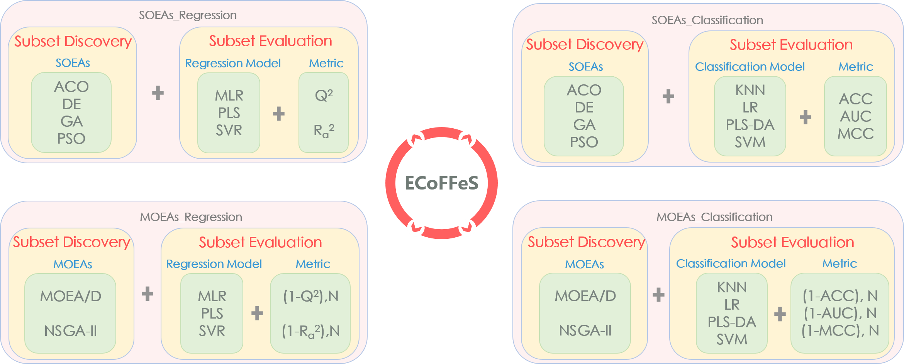
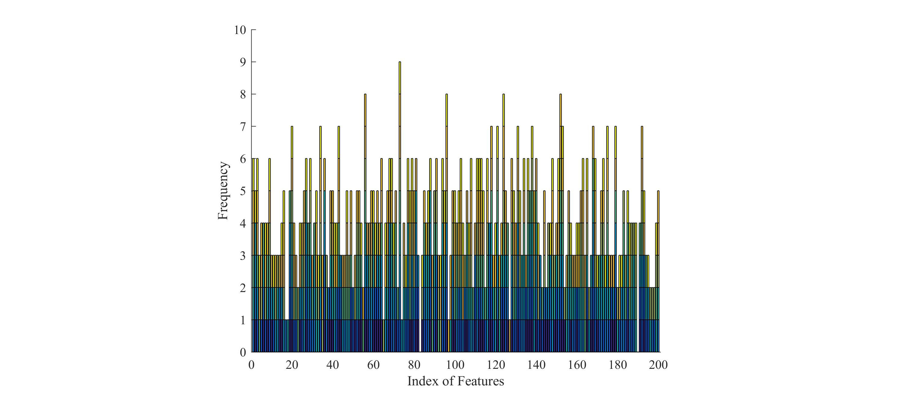

.. image:: Others/Logo/logo.png
   :align: center

Installer
-----------------------------------

Operating Systems: 64-Bit, WinServer 2012 / Win7 SP1 / Win8 / Win8.1 / Win10

ECoFFeS's Installer: https://github.com/JiaweiHuang/ECoFFeS/tree/master/ECoFFeS_Installer

User Manual
-----------------------------------

Contents: Installation Guide, Graphical User Interface, Introduction to ECoFFeS, and Applications of ECoFFeS

ECoFFeS Manual: https://github.com/JiaweiHuang/ECoFFeS/tree/master/ECoFFeS_User_Manual/ECoFFeS_Manual.pdf

Further Development
-----------------------------------

ECoFFeS is an open-source software which is developed based on MATLAB (Windows/Linux/Mac), release >= R2016a

ECoFFeS's Source Code: https://github.com/JiaweiHuang/ECoFFeS/tree/master/Others/Further_Development

PPT
-----------------------------------

A brief introduction to ECoFFeS

ECoFFeS's PPT: https://github.com/JiaweiHuang/ECoFFeS/tree/master/Others/PPT

License
-----------------------------------

ECoFFeS is freely available under the GNU General Public License.

License: https://github.com/JiaweiHuang/ECoFFeS/blob/master/Others/License/LICENSE

Publication
-----------------------------------

Zhi-Zhong Liu, Jia-Wei Huang, Yong Wang and Dong-Sheng Cao. ECoFFeS: A Software Using Evolutionary Computation for Feature Selection in Drug Discovery. IEEE Access, *in press*.

Abstract
-----------------------------------

Feature selection is of particular importance in the field of drug discovery. Many methods have been put forward for feature selection during recent decades. Among them, evolutionary computation has gained increasing attention owing to its superior global search ability. However, there still lacks a simple and efficient software for drug developers to take advantage of evolutionary computation for feature selection. To remedy this issue, in this paper, a user-friendly and standalone software, named ECoFFeS, is developed. ECoFFeS is expected to lower the entry barrier for drug developers to deal with feature selection problems at hand by using evolutionary algorithms. To the best of our knowledge, it is the first software integrating a set of evolutionary algorithms (including two modified evolutionary algorithms proposed by the authors) with various evaluation combinations for feature selection. Specifically, ECoFFeS considers both single-objective and multi-objective evolutionary algorithms, and both regression- and classification-based models to meet different requirements. Five datasets in drug discovery are collected in ECoFFeS. In addition, to reduce the total analysis time, the parallel execution technique is incorporated into ECoFFeS. 

Internal Structure of ECoFFeS
-----------------------------------

( 1 ) Subset Discovery is a search procedure to generate candidate feature subsets. ECoFFeS involves two novel EAs (modified DE and modified MOEA/D proposed by the authors) and four existing state-of-the-art EAs, namely, ACO, GA, PSO, and NSGA-II. Among them, four are single-objective EAs (SOEAs) and two are multi-objective EAs (MOEAs).
   
( 2 ) Subset Evaluation seeks to assess the candidate feature subsets generated by Subset Discovery. In ECoFFeS, 36 evaluation combinations are provided for users. Among them, 12 are used for regression, which are the combinations of regression-based models and metrics, and 24 are used for classification, which are the combinations of classification-based models and metrics.
   
   
Characteristics of ECoFFeS
-----------------------------------
( 1 ) ECoFFeS is a free standalone software which does not require researchers to have any knowledge of programming.

( 2 ) ECoFFeS is an open-source software which can be readily extended to solve customized feature selection problems.

( 3 ) If feature selection is treated as a single-objective optimization problem, SOEAs aim at obtaining a satisfactory feature subset and providing the rankings of the important features simultaneously. On the other hand, if feature selection is formulated as a multi-objective optimization problem, by utilizing MOEAs, we expect to maintain a set of non-dominated feature subsets with a tradeoff between the number of features and the corresponding metric. Afterwards, the decision maker can select one final feature subset that matches at most his/her preference.

( 4 ) On the basis of Subset Discovery and Subset Evaluation, ECoFFeS is a generic tool to tackle feature selection problems in different types of applications.

( 5 ) ECoFFeS supports parallel execution which is a useful strategy to make full use of the processing ability of multi-core computers and to significantly reduce computational time.

A Case Study - Microarray Analysis
-----------------------------------

( 1 ) Dataset: "Leukemia" dataset (a benchmark microarray dataset), which investigates the expression of two different subtypes of leukemia (47 ALL and 25 AML).

Golub, Todd R., et al. "Molecular classification of cancer: class discovery and class prediction by gene expression monitoring." *science* 286.5439 (1999): 531-537.

( 2 ) Data Pre-processing: Data pre-processing is of great importance and can have significant influence on the success of the overall analysis. Based on the previous studies, only a few dozens of genes are needed for sample classification in general. Therefore, for "Leukemia" dataset 200 genes are pre-filtered from the train sets, which are then suitable for follow up precise gene selection.

Leukemiatrain_pretreat.xlsx: https://github.com/JiaweiHuang/ECoFFeS/tree/master/Others/Experiment_Datasets/Microarray_Aanlysis

( 3 ) Parameters of "SOEAs_Classification" —— SOEA: DE; Model: PLS-DA; Metric: MCC; Popsize: 100; Iteration: 200; and Runs: 10;

( 4 ) Experimental Results: 

According to the above figure, 17 genes with the highest selection frequency are listed as follows.

``M86406_at``, ``M37190_at``, ``U43292_at``, ``X63469_at``, ``U22376_cds2_s_at``, ``HG4188-HT4458_at``, ``L11669_at``, ``L49054_at``, ``X17094_at``, ``X55668_at``, ``X95735_at``, ``Z32765_at``, ``L07807_s_at``, ``Y00787_s_at``, ``M63838_s_at``, ``X15673_s_at``, and ``HG3921-HT4191_f_at``.

**More case studies please refer to User Manual.**

